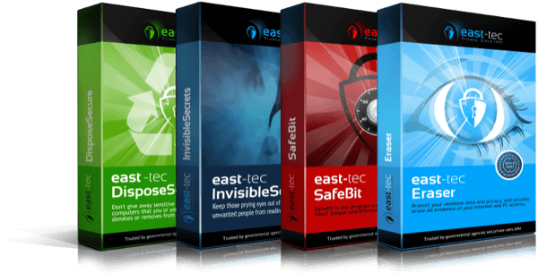

# Portmarks

**Portmarks** lets you create portable HTML bookmark files for any web page. Your bookmarks work everywhere—no browser sync, no cloud dependency, just tiny files you own. Free and open source.

- **Universal:** Bookmarks are simple HTML files that redirect to your saved page. Use them on any device or platform.
- **Private:** No cloud, no tracking, no account required. You own your bookmarks.
- **Bookmarklet:** Portmarks is a bookmarklet that works in any modern browser and it's easy to install. Just drag the button to your bookmarks bar!

## Quick Start

1. Download the [Portmarks bookmarklet](https://github.com/aurelitec/Portmarks/releases/latest/download/portmarks-bookmarklet-1.0.0.zip) from GitHub Releases and unzip it.
2. Open the `install.html` file in your browser.
3. Drag the **Portmarks** button to your bookmarks bar.
4. Click the bookmarklet on any page to download a portable bookmark file.

## Project Structure

- `bookmarklet/` — Source code and install files for the Portmarks bookmarklet.
- `bookmarklet/dist/` — Distribution files and release ZIPs (after building).

## Support Us!

Portmarks is free and open source because it's supported by [East-Tec](https://www.east-tec.com/), developers of innovative and award-winning privacy and security products and solutions since 1997. Try the East-Tec products to protect your privacy and keep your data secure.

**While Portmarks helps you save the sites you want to remember, [east-tec Eraser](https://www.east-tec.com/eraser/) helps you forget the ones you don't want anyone to know about.**
